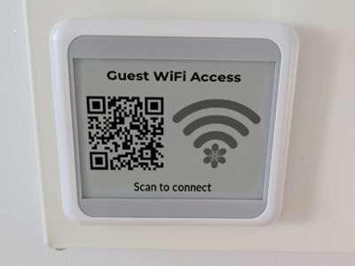

# Wi-Fi QR Code Display Generator for E-Paper

This script generates a stylish, scannable **Wi-Fi QR code** display image, optimized for e-paper displays. It includes a customizable header, optional logo/image, and subtext. The final output can be either grayscale or black-and-white for e-paper compatibility.

---

## ✨ Features

- QR code generation for Wi-Fi login (SSID, WPA password)
- Optional logo/image aligned to the right
- Custom header and subtext
- Output as grayscale or monochrome (e-paper)
- Automatically sized for 400x300 e-paper displays
- Uses ImageMagick and qrencode

---

## 🧰 Requirements

- [ImageMagick](https://imagemagick.org)
- [qrencode](https://fukuchi.org/works/qrencode/)

Install on Ubuntu/Debian:

```bash
sudo apt install imagemagick qrencode
```

---

## 🚀 Usage

```bash
./generate.sh [options]
```

### 🏷️ Options

| Flag            | Description                           | Example                            |
|-----------------|---------------------------------------|------------------------------------|
| `-h`, `--header`    | Header text                         | `"Guest WiFi Access"`              |
| `-p`, `--pass`      | WPA password                        | `"WPApassword"`                    |
| `-s`, `--ssid`      | SSID name                           | `"GuestSSID"`                      |
| `-t`, `--text`      | Bottom subtext                      | `"Scan to connect"`               |
| `-i`, `--image`     | Logo/image file path                | `"icon_wifi.png"`                  |
| `-o`, `--output`    | Output image filename               | `"eink_display.png"`               |
| `-m`, `--monochrome`| Convert final image to pure B/W     | *(flag only, no value needed)*     |
| `--help`            | Show usage                          |                                    |

---

## 📸 Example

```bash
./generate.sh \
  -h "Guest WiFi Access" \
  -p "WPApassword" \
  -s "GuestSSID" \
  -t "Scan to connect" \
  -i "icon_wifi.png" \
  -o "eink_display.png" \
  -m
```

This will generate a 400x300 black-and-white PNG named `eink_display.png` that looks great on e-paper screens.

## Examples
|Example output | Example e-paper |
|---|---|
| | |
---

## 🧹 Cleanup

The script automatically removes all temporary images used during processing.

---

## 📄 License

MIT – feel free to use and modify!

---

## 🙏 Credits

Made with ❤️ for digital hospitality.
